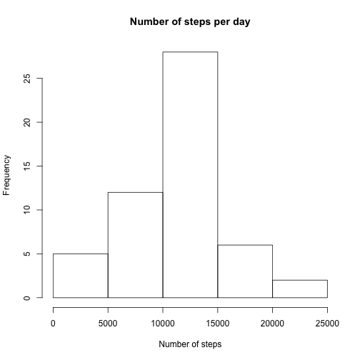
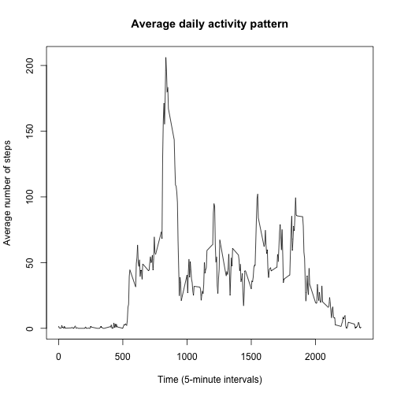
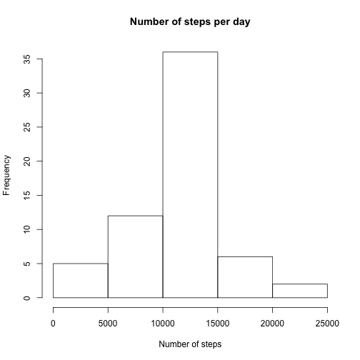
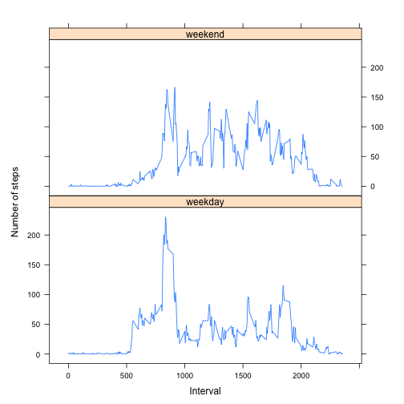

## Loading and preprocessing the data

The activity monitoring original data for this assignment was obtained from [here](https://d396qusza40orc.cloudfront.net/repdata%2Fdata%2Factivity.zip). A copy of this data has been included as activity.zip and unzipped as activity.csv in this project.

Load the data:


```r
activityMonitoringData <- read.csv('activity.csv')
str(activityMonitoringData)
```

```
## 'data.frame':	17568 obs. of  3 variables:
##  $ steps   : int  NA NA NA NA NA NA NA NA NA NA ...
##  $ date    : Factor w/ 61 levels "2012-10-01","2012-10-02",..: 1 1 1 1 1 1 1 1 1 1 ...
##  $ interval: int  0 5 10 15 20 25 30 35 40 45 ...
```

Process/transform the data if necessary into a format suitable for your analysis.

* The steps variable has NA values but we can leave them as they are for the time being.

* Convert the date variable to Date types:


```r
activityMonitoringData$date <- as.Date(activityMonitoringData$date)
str(activityMonitoringData)
```

```
## 'data.frame':	17568 obs. of  3 variables:
##  $ steps   : int  NA NA NA NA NA NA NA NA NA NA ...
##  $ date    : Date, format: "2012-10-01" "2012-10-01" ...
##  $ interval: int  0 5 10 15 20 25 30 35 40 45 ...
```


## What is mean total number of steps taken per day?

Calculate the total number of steps taken per day:


```r
numberOfStepsPerDay <- 
  aggregate(steps ~ date, data = activityMonitoringData, FUN = sum)
```

Make a histogram of the total number of steps taken each day:


```r
hist(
  numberOfStepsPerDay$steps, 
  xlab = 'Number of steps', 
  main = 'Number of steps per day')
```



Calculate and report the mean and median of the total number of steps taken per day:


```r
mean(numberOfStepsPerDay$steps)
```

```
## [1] 10766.19
```


```r
median(numberOfStepsPerDay$steps)
```

```
## [1] 10765
```


## What is the average daily activity pattern?

Make a time series plot (i.e. 𝚝𝚢𝚙𝚎 = "𝚕") of the 5-minute interval (x-axis) and the average number of steps taken, averaged across all days (y-axis):


```r
averageNumberOfStepsPerInterval <- 
  aggregate(steps ~ interval, data = activityMonitoringData, FUN = mean)

plot(
  steps ~ interval, 
  data = averageNumberOfStepsPerInterval, 
  xlab = 'Time (5-minute intervals)', 
  ylab = 'Average number of steps', 
  main = 'Average daily activity pattern',
  type = 'l')
```



Which 5-minute interval, on average across all the days in the dataset, contains the maximum number of steps?


```r
averageNumberOfStepsPerInterval[which.max(averageNumberOfStepsPerInterval$steps), ]$interval
```

```
## [1] 835
```


## Imputing missing values

Calculate and report the total number of missing values in the dataset (i.e. the total number of rows with 𝙽𝙰s):


```r
sum(is.na(activityMonitoringData$steps))
```

```
## [1] 2304
```

Devise a strategy for filling in all of the missing values in the dataset. The strategy does not need to be sophisticated. For example, you could use the mean/median for that day, or the mean for that 5-minute interval, etc.

Using the mean for that 5-minute interval:


```r
filledInActivityMonitoringData <- activityMonitoringData

for (i in which(is.na(filledInActivityMonitoringData$steps))) {
  filledInActivityMonitoringData$steps[i] <-
    averageNumberOfStepsPerInterval$steps[which(averageNumberOfStepsPerInterval$interval == filledInActivityMonitoringData$interval[i])]
}
```

Create a new dataset that is equal to the original dataset but with the missing data filled in, the new dataset is filledInActivityMonitoringData:


```r
head(filledInActivityMonitoringData)
```

```
##       steps       date interval
## 1 1.7169811 2012-10-01        0
## 2 0.3396226 2012-10-01        5
## 3 0.1320755 2012-10-01       10
## 4 0.1509434 2012-10-01       15
## 5 0.0754717 2012-10-01       20
## 6 2.0943396 2012-10-01       25
```

Make a histogram of the total number of steps taken each day and Calculate and report the mean and median total number of steps taken per day. Do these values differ from the estimates from the first part of the assignment? What is the impact of imputing missing data on the estimates of the total daily number of steps?

Performing the same analysis as before:


```r
numberOfStepsPerDay <- 
  aggregate(steps ~ date, data = filledInActivityMonitoringData, FUN = sum)

hist(
  numberOfStepsPerDay$steps, 
  xlab = 'Number of steps', 
  main = 'Number of steps per day')
```




```r
mean(numberOfStepsPerDay$steps)
```

```
## [1] 10766.19
```


```r
median(numberOfStepsPerDay$steps)
```

```
## [1] 10766.19
```

The median value has changed.


## Are there differences in activity patterns between weekdays and weekends?

Create a new factor variable in the dataset with two levels – “weekday” and “weekend” indicating whether a given date is a weekday or weekend day.


```r
filledInActivityMonitoringData$day <-
  ifelse(
    weekdays(filledInActivityMonitoringData$date) == 'Saturday' |
      weekdays(filledInActivityMonitoringData$date) == 'Sunday',
    'weekend',
    'weekday'
  )

str(filledInActivityMonitoringData)
```

```
## 'data.frame':	17568 obs. of  4 variables:
##  $ steps   : num  1.717 0.3396 0.1321 0.1509 0.0755 ...
##  $ date    : Date, format: "2012-10-01" "2012-10-01" ...
##  $ interval: int  0 5 10 15 20 25 30 35 40 45 ...
##  $ day     : chr  "weekday" "weekday" "weekday" "weekday" ...
```

Convert the day variable to a factor variable.


```r
filledInActivityMonitoringData$day <- factor(filledInActivityMonitoringData$day)

str(filledInActivityMonitoringData)
```

```
## 'data.frame':	17568 obs. of  4 variables:
##  $ steps   : num  1.717 0.3396 0.1321 0.1509 0.0755 ...
##  $ date    : Date, format: "2012-10-01" "2012-10-01" ...
##  $ interval: int  0 5 10 15 20 25 30 35 40 45 ...
##  $ day     : Factor w/ 2 levels "weekday","weekend": 1 1 1 1 1 1 1 1 1 1 ...
```

Make a panel plot containing a time series plot (i.e. 𝚝𝚢𝚙𝚎 = "𝚕") of the 5-minute interval (x-axis) and the average number of steps taken, averaged across all weekday days or weekend days (y-axis).


```r
library(lattice)

xyplot(
  steps ~ interval | day,
  data = aggregate(steps ~ interval + day, filledInActivityMonitoringData, mean),
  xlab = 'Interval',
  ylab = 'Number of steps',
  aspect = 1 / 2,
  type = "l"
)
```



From the plot we can see that the weekend data is more uniform than the weekday data.
